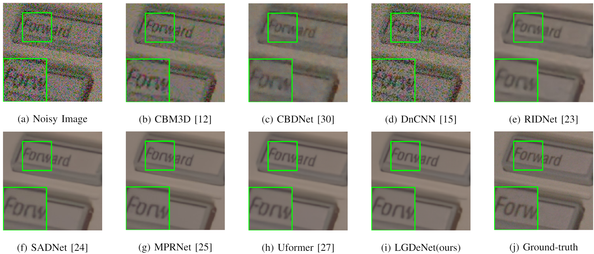
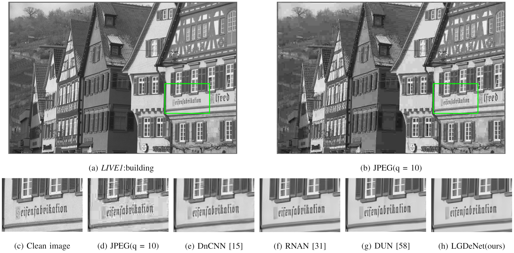
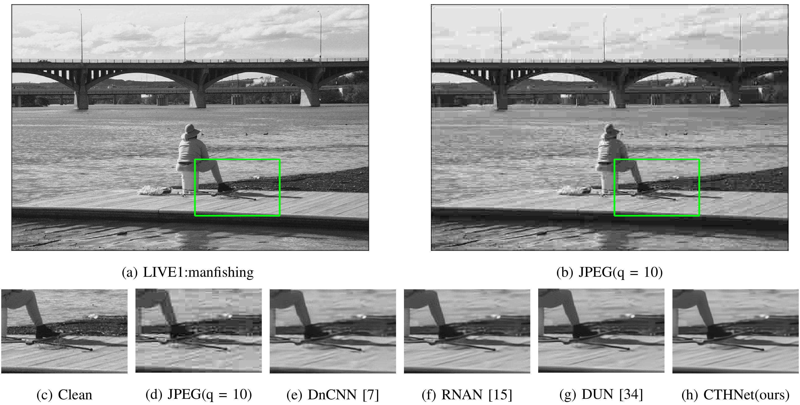

# Bridging CNN and Transformer in Image Restoration
This repository is for CTHNet
## Introduction
In this paper, we proposed CTHNet for image restoration, which is a hybrid network with CNNs and Transformer. Specifically, our CTHNet includes CNN units and Transformer units. During the denoising processing, the two kinds of units can exchange information. Benefiting from the locality of CNN, we employ series of channel attention blocks (CABs) in each CNN unit to retain spatial
details in images. In the Transformer unit, we build a multi-scale transformer that utilizes the feature map with different scales to capture long-range dependencies. It is noted that each
downsampled feature map will be restored to its original size and our Transformer unit utilizes lots of skip connections,
these are effective ways to reduce information loss caused by
continuous downsampling operation. Moreover, we design a
mutual-learning mechanism to improve the mutual learning
ability of Transformer and CNN.

## Feature Visualization

## Synthetic image denoising
### BSD68 Dataset

### Kodak24 Dataset

## Real Image Denoising
### SIDD Dataset

### DnD Dataset

## Image Compression Artifact Reduction
### LIVE1 Dataset

