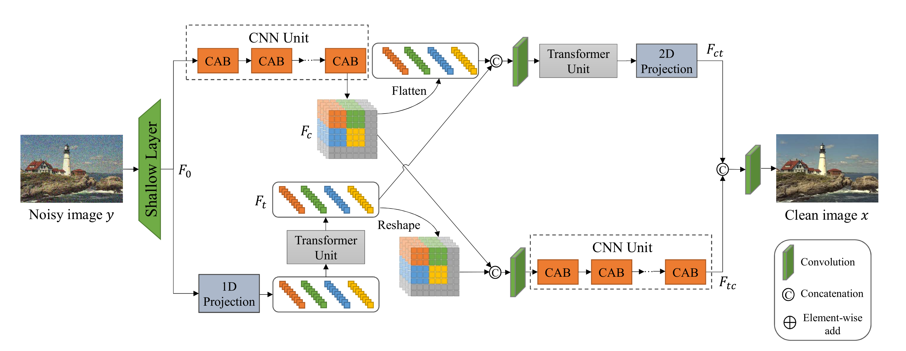
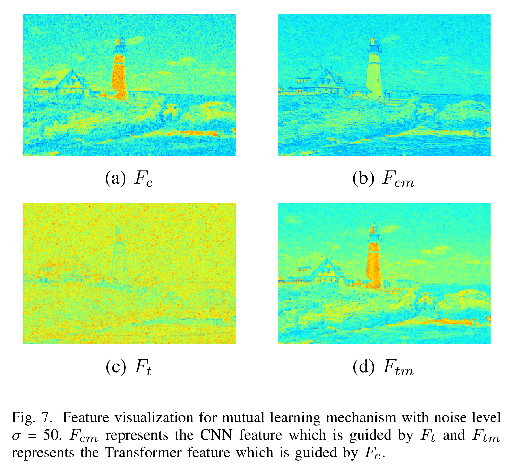
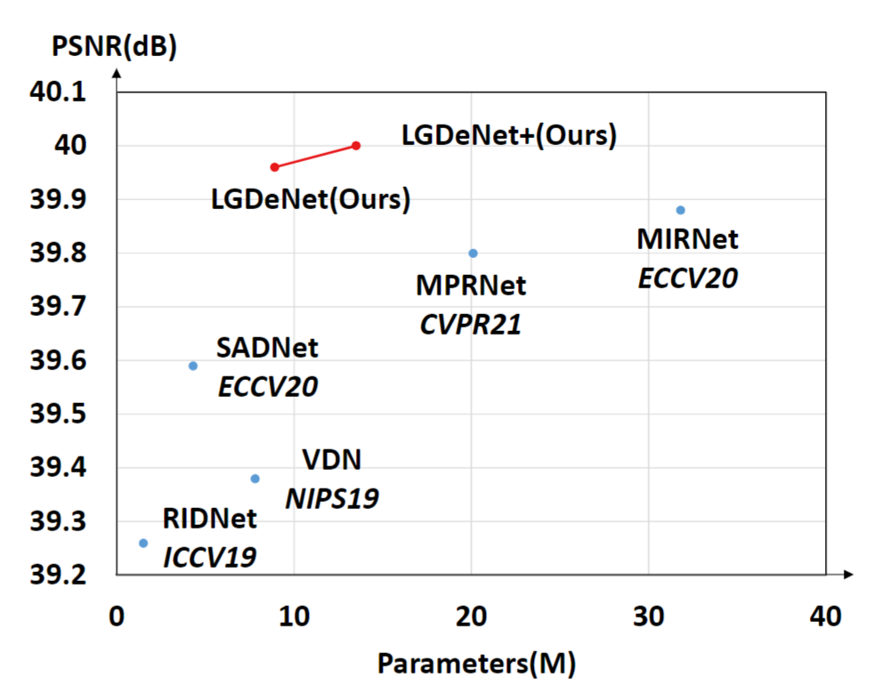
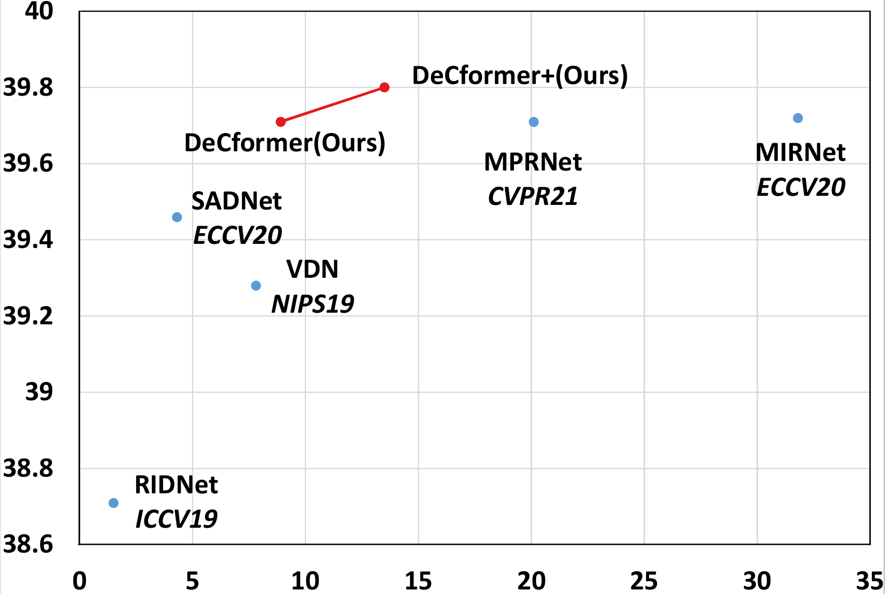
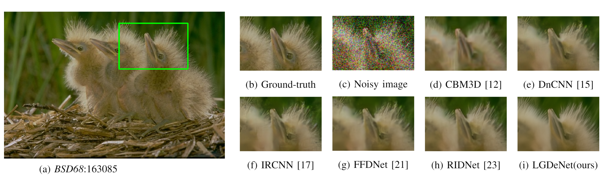
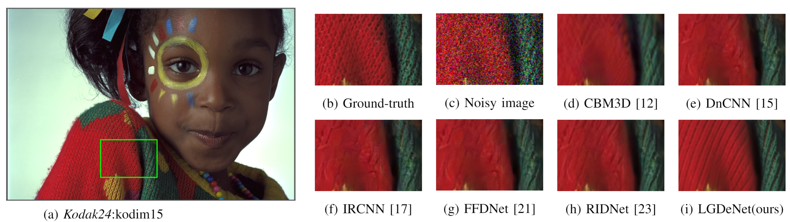
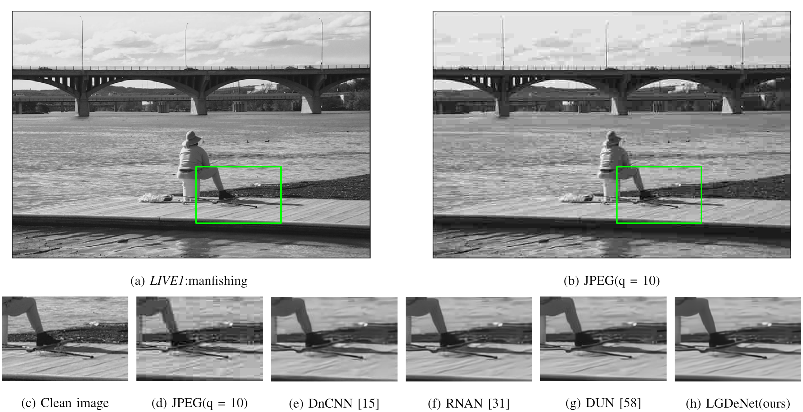

# DeCformer: Image Denoising Network with CNNs and Transformer
This repository is for DeCformer
## Introduction
Image denoising aims to restore a high-quality image from the noisy version.  In this paper, we regard image denoising as a optimization process of a MAP problem and develop a local-global decomposite based denoising network (LGDeNet) integrating the advantages of convolutional models and Transformer models.
Specifically, our network is composed of attention-based CNN units and multi-scale Transformer units. The CNN unit which consists of cascaded channel attention blocks (CABs) is designed to preserve the local structures. The Transformer unit introduces a multi-scale architecture to capture the global features in the given images. The proposed method exploits a multi-scale feature hierarchical architecture to assemble multiple Transformer models. To save the memory cost, we expand the channel capacity while reducing the spatial resolution. Moreover, a mutual-learning mechanism is applied to improve the learning ability of the whole network, by exchanging information between the CNN units and the Transformer units. The performance of LGDeNet is experimentally verified on a variety of synthetic images at various noise levels, and on real-world noisy images. In addition, we also show the effectiveness of our proposed method for compression artifact reduction. Compared with some state-of-the-art denoising works with respect to both objective and subjective evaluation.

## pre-trained models
The pre-trained models are available at [Baidu Yun](https://pan.baidu.com/s/1WoUUWjhU8SsncEAB5AGGSw) with code:**crk6**.

## Feature Visualization

## performance
### DnD Dataset

### SIDD Dataset

## Synthetic image denoising
### CBSD68 Dataset

### Kodak24 Dataset

## Real Image Denoising
### SIDD Dataset

You can download the all [SIDD denoised images](https://pan.baidu.com/s/1rUcImvN61J0uSeIbCqnLvQ) with code:**mk5p**.
### DnD Dataset

## Image Compression Artifact Reduction
### LIVE1 Dataset

## Train and Test
The source code is coming...
